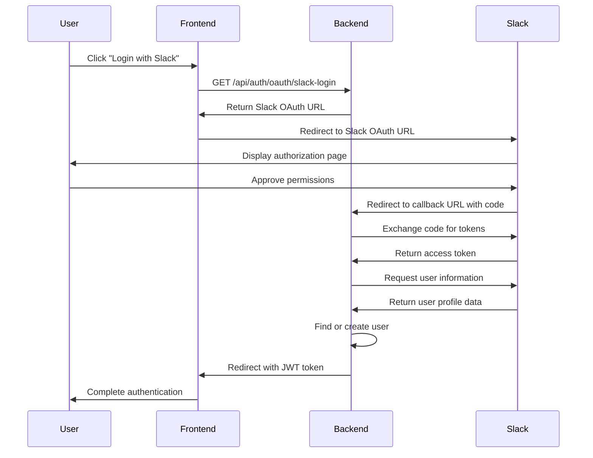

# Slack OAuth Integration Documentation

## Table of Contents
1. [Overview](#overview)
2. [Environment Configuration](#environment-configuration)
3. [API Endpoints](#api-endpoints)
4. [Database Schema](#database-schema)
5. [Authentication Flow](#authentication-flow)
6. [Security Considerations](#security-considerations)
7. [Testing Procedures](#testing-procedures)
8. [Future Improvements](#future-improvements)

## Overview

The Slack OAuth integration enables users to authenticate with our NestJS backend application using their Slack accounts. This integration supports both signup and login flows, allowing users to create new accounts or access existing ones using their Slack credentials.

### Key Features

- **Seamless Authentication**: Users can authenticate with a single click using their Slack accounts
- **Profile Data Import**: Automatically imports user profile data (name, email, profile picture) from Slack
- **Dual-Flow Support**: Separate endpoints for login and signup processes
- **JWT-Based Sessions**: Generates JWT tokens for authenticated users

### Integration Architecture

The integration uses Passport.js with a custom Slack strategy to handle the OAuth 2.0 flow. It's implemented as part of the authentication module and works alongside other authentication methods (email/password, Google OAuth) to provide a comprehensive authentication system.

### OAuth Flow Overview

1. User initiates authentication by clicking a Slack button
2. Application redirects to Slack's authorization page
3. User approves the requested permissions
4. Slack redirects back to our application with an authorization code
5. Application exchanges the code for access tokens
6. Application retrieves user information and creates/finds the user account
7. Application generates a JWT token and completes authentication

This integration follows OAuth 2.0 best practices and is designed to be secure, reliable, and maintainable.

## Environment Configuration

The Slack OAuth integration requires several environment variables to be properly configured. These variables contain sensitive information and should be handled securely.

### Required Environment Variables

| Variable | Description | Example |
|----------|-------------|---------|
| `SLACK_CLIENT_ID` | The client ID provided by Slack when you register your application | `9279816544384.9279824747776` |
| `SLACK_CLIENT_SECRET` | The client secret provided by Slack (keep this secure) | `f218016f5f05bbbed33c396ccfa9d93f` |
| `SLACK_SIGNING_SECRET` | The signing secret used to verify requests from Slack | `3d08621ff7cb0e175b692def95caf340` |
| `SLACK_VERIFICATION_TOKEN` | The verification token for Slack API requests | `oSBLlvpxnN9vR3neCoTEFbMi` |
| `SLACK_REDIRECT_URI` | The URI where Slack will redirect after authorization | `http://localhost:3000/api/auth/callback/slack` |
| `JWT_SECRET` | Secret key used to sign JWT tokens | `your-jwt-secret-key` |

### Configuration Setup

1. **Slack App Configuration**:
   - Create a Slack App in the [Slack API Console](https://api.slack.com/apps)
   - Under "OAuth & Permissions", add the redirect URI
   - Request the following OAuth scopes: `identity.basic`, `identity.email`, `identity.avatar`
   - Install the app to your workspace
   - Copy the provided credentials to your environment variables

2. **Environment File Setup**:
   - Create a `.env` file in the root directory of your project
   - Add the required environment variables with their values
   - Ensure this file is included in `.gitignore` to prevent exposing secrets

3. **Production Considerations**:
   - In production, use a secure environment variable management system
   - Consider using different Slack Apps for development and production
   - Regularly rotate secrets for enhanced security

### Configuration Validation

The application validates these environment variables during startup. If any required variables are missing, appropriate error messages will be logged, and the Slack OAuth functionality will be disabled.

```typescript
// Example validation in the SlackStrategy constructor
constructor(private configService: ConfigService) {
  super({
    clientID: configService.get<string>('SLACK_CLIENT_ID'),
    clientSecret: configService.get<string>('SLACK_CLIENT_SECRET'),
    callbackURL: configService.get<string>('SLACK_REDIRECT_URI'),
    scope: ['identity.basic', 'identity.email', 'identity.avatar'],
  });
}
```

## API Endpoints

The Slack OAuth integration exposes several endpoints to handle different aspects of the authentication flow. These endpoints are defined in the `AuthController` class.

### OAuth Initiation Endpoints

#### General OAuth Initiation

```
GET /api/auth/oauth/slack
```

This endpoint generates and returns a Slack OAuth URL that can be used for general authentication purposes.

**Request Format**: No parameters required

**Response Format**:
```json
{
  "url": "https://slack.com/oauth/v2/authorize?client_id=YOUR_CLIENT_ID&redirect_uri=YOUR_REDIRECT_URI&response_type=code&scope=identity.basic%20identity.email%20identity.avatar&state=login"
}
```

**Error Handling**:
- Returns 500 status code if Slack OAuth is not properly configured

#### Login-Specific OAuth Flow

```
GET /api/auth/oauth/slack-login
```

This endpoint generates a Slack OAuth URL specifically for the login flow.

**Request Format**: No parameters required

**Response Format**: Same as general OAuth initiation, but with `state=login`

**Error Handling**: Same as general OAuth initiation

#### Signup-Specific OAuth Flow

```
GET /api/auth/oauth/slack-signup
```

This endpoint generates a Slack OAuth URL specifically for the signup flow.

**Request Format**: No parameters required

**Response Format**: Same as general OAuth initiation, but with `state=signup`

**Error Handling**: Same as general OAuth initiation

### OAuth Callback Endpoints

#### Slack Callback Handler

```
GET /api/auth/callback/slack
```

This endpoint handles the callback from Slack after user authorization.

**Request Format**:
- `code` (query parameter): The authorization code from Slack
- `state` (query parameter, optional): The state parameter (login/signup)

**Response Format**:
- On success: Redirects to frontend with JWT token
- On error: Redirects to frontend with error message

**Error Handling**:
- Returns 400 status code for invalid requests
- Returns 500 status code for server errors
- Redirects with error message for authentication failures

### Alternative Code Exchange Endpoint

```
POST /api/auth/slack
```

This endpoint provides an alternative way to exchange a code for tokens, useful for mobile apps or specific frontend implementations.

**Request Format**:
```json
{
  "code": "slack_authorization_code"
}
```

## Database Schema

The Slack OAuth integration stores user data in the MongoDB database using Mongoose. This section describes the database schema used for storing Slack user information.

### User Model

The `User` model is defined in `src/users/user.model.ts` and includes fields for storing Slack-specific user data:

```typescript
@Schema({ timestamps: true })
export class User extends Document {
  @Prop({ required: true })
  name: string;

  @Prop({ required: true, unique: true })
  email: string;

  @Prop()
  password: string;

  @Prop()
  google_id?: string;

  @Prop()
  slack_id?: string;

  @Prop()
  profile_picture?: string;

  @Prop({ default: 'manual' })
  signup_method: string;

  // createdAt will be auto-managed by Mongoose
  createdAt: Date;
}
```

### Schema Fields

| Field | Type | Description |
|-------|------|-------------|
| `name` | String | User's full name, obtained from Slack profile |
| `email` | String | User's email address, obtained from Slack profile |
| `slack_id` | String | Unique identifier for the user in Slack |
| `profile_picture` | String | URL to the user's profile picture from Slack |
| `signup_method` | String | Set to 'slack' for users who signed up with Slack |
| `createdAt` | Date | Timestamp when the user account was created |

### Data Storage

When a user authenticates with Slack for the first time (signup flow), the following data is stored:

1. Basic profile information (name, email)
2. Slack user ID for future authentication
3. Profile picture URL
4. Signup method is set to 'slack'

For returning users (login flow), the system:

1. Looks up the user by Slack ID
2. If not found, attempts to find by email
3. Does not store any new data, just issues a JWT token

### User Lookup Logic

The `UsersService` provides methods to find users by provider ID or email:

```typescript
async findByProviderId(provider: string, providerId: string): Promise<User | null> {
  if (provider === 'google') {
    return this.userModel.findOne({ google_id: providerId }).exec();
  } else if (provider === 'slack') {
    return this.userModel.findOne({ slack_id: providerId }).exec();
  }
  return null;
}

async findByEmail(email: string): Promise<User | null> {
  return this.userModel.findOne({ email: email.trim().toLowerCase() }).exec();
}
```

### User Creation

New users are created with the `createUser` method:

```typescript
async createUser(data: Partial<User>): Promise<User> {
  if (data.email) {
    data.email = data.email.trim().toLowerCase();
  }
  const user = new this.userModel(data);
  return user.save();
}
```

### Database Considerations

1. **Indexes**: The `email` field is indexed for faster lookups
2. **Unique Constraints**: Email addresses must be unique across all users
3. **Optional Fields**: `slack_id` and `profile_picture` are optional to support multiple authentication methods
4. **Data Normalization**: Email addresses are normalized (trimmed and lowercased) before storage

## Authentication Flow

This section provides a detailed explanation of the Slack OAuth authentication flow and its implementation in our NestJS backend.

### OAuth 2.0 Flow Overview

The Slack OAuth integration follows the standard OAuth 2.0 authorization code flow:

1. **Authorization Request**: The user is redirected to Slack's authorization page
2. **User Consent**: The user approves the requested permissions
3. **Authorization Code**: Slack redirects back to our application with an authorization code
4. **Token Exchange**: Our application exchanges the code for access tokens
5. **User Information**: Our application retrieves user information using the access token
6. **Account Creation/Lookup**: Our application creates a new user account or finds an existing one
7. **JWT Generation**: Our application generates a JWT token for the authenticated user

### Detailed Flow Diagram



### Implementation Details

#### 1. Slack Strategy

The Slack authentication strategy is implemented using Passport.js with the `passport-slack-oauth2` package:

```typescript
@Injectable()
export class SlackStrategy extends PassportStrategy(Strategy, 'slack') {
  constructor(private configService: ConfigService) {
    super({
      clientID: configService.get<string>('SLACK_CLIENT_ID'),
      clientSecret: configService.get<string>('SLACK_CLIENT_SECRET'),
      callbackURL: configService.get<string>('SLACK_REDIRECT_URI'),
      scope: ['identity.basic', 'identity.email', 'identity.avatar'],
    });
  }

  async validate(accessToken: string, refreshToken: string, profile: any, done: any) {
    const { id, user } = profile;
    const { email, name, image_512 } = user;
    
    const userData = {
      slack_id: id,
      email,
      name,
      profile_picture: image_512,
      provider: 'slack',
    };

    return userData;
  }
}
```

#### 2. OAuth URL Generation

The `getSlackOAuthUrl` method in the `AuthService` generates the OAuth URL:

```typescript
async getSlackOAuthUrl(res, mode: 'login' | 'signup' = 'login') {
  const clientId = this.configService.get<string>('SLACK_CLIENT_ID');
  const redirectUri = this.configService.get<string>('SLACK_REDIRECT_URI');
  
  if (!clientId || !redirectUri) {
    return res.status(500).json({ error: 'Slack OAuth is not configured properly.' });
  }
  
  // Define the scopes needed for user identification
  const scope = ['identity.basic', 'identity.email', 'identity.avatar'].join(' ');
  
  // Construct the Slack OAuth URL
  const url =
    'https://slack.com/oauth/v2/authorize' +
    `?client_id=${clientId}` +
    `&redirect_uri=${encodeURIComponent(redirectUri)}` +
    `&response_type=code` +
    `&scope=${encodeURIComponent(scope)}` +
    `&state=${mode}`;  // Pass mode as state parameter
  
  return res.json({ url });
}
```

#### 3. OAuth Callback Handling

The `handleSlackOAuthCallback` method processes the callback from Slack:

```typescript
async handleSlackOAuthCallback(query, res) {
  const code = query.code;
  const mode = query.mode || 'login';
  
  if (!code) {
    return { error: 'No code provided' };
  }
  
  // Exchange code for tokens
  const tokenRes = await axios.post(
    'https://slack.com/api/oauth.v2.access',
    new URLSearchParams({
      code: String(code),
      client_id: String(clientId),
      client_secret: String(clientSecret),
      redirect_uri: String(redirectUri),
    }),
    { headers: { 'Content-Type': 'application/x-www-form-urlencoded' } }
  );
  
  // Get user info
  const userInfoRes = await axios.get('https://slack.com/api/users.identity', {
    headers: {
      Authorization: `Bearer ${access_token}`,
    },
  });
  
  // Find or create user
  let userRecord = await this.usersService.findByProviderId('slack', slack_id);
  if (!userRecord && email) {
    userRecord = await this.usersService.findByEmail(email);
  }
  
  // Handle login or signup flow
  if (mode === 'login') {
    // Login flow
    // ...
  } else if (mode === 'signup') {
    // Signup flow
    // ...
  }
  
  // Generate JWT token
  const jwtPayload = { sub: userRecord._id, email: userRecord.email, name: userRecord.name, signup_method: userRecord.signup_method };
  const token = this.jwtService.sign(jwtPayload);
  
  // Redirect with token
  return res.redirect(`http://localhost:3001/auth/callback?token=${token}`);
}
```

#### 4. Login vs. Signup Flow

The implementation distinguishes between login and signup flows:

- **Login Flow**: Looks for an existing user by Slack ID or email. If found, generates a JWT token. If not found, returns an error.
- **Signup Flow**: Checks if a user with the Slack ID or email already exists. If not, creates a new user. If already exists, returns an error.

#### 5. Error Handling

The implementation includes comprehensive error handling:

- Validates required environment variables
- Checks for missing authorization code
- Handles Slack API errors
- Provides appropriate error messages for different scenarios
- Logs errors for debugging purposes

#### 6. JWT Token Generation

After successful authentication, a JWT token is generated with user information:

```typescript
const jwtPayload = {
  sub: userRecord._id,
  email: userRecord.email,
  name: userRecord.name,
  signup_method: userRecord.signup_method
};
const token = this.jwtService.sign(jwtPayload);
```

This token is then used for subsequent authenticated requests to the API.

## Security Considerations

Security is a critical aspect of any OAuth integration. This section outlines the security measures implemented in our Slack OAuth integration and provides recommendations for maintaining a secure authentication system.

### Implemented Security Measures

#### 1. Environment Variable Protection

- Sensitive credentials (client ID, client secret) are stored as environment variables
- Environment files are excluded from version control via `.gitignore`
- Different environment configurations for development and production

#### 2. HTTPS Usage

- All communication with Slack APIs occurs over HTTPS
- Production deployments should enforce HTTPS for all endpoints

#### 3. Token Handling

- Access tokens are never stored in the database
- Access tokens are only used for the initial user information retrieval
- JWT tokens have a limited expiration time (1 hour by default)

#### 4. Input Validation

- All input parameters are validated before use
- Query parameters and request bodies are properly sanitized

#### 5. Error Handling

- Detailed error information is logged but not exposed to clients
- Generic error messages are returned to users to prevent information leakage

#### 6. State Parameter

- The `state` parameter is used to prevent CSRF attacks
- The state is passed through the OAuth flow and verified on callback

### Security Best Practices

#### 1. Regular Secret Rotation

Regularly rotate the following secrets:

- `SLACK_CLIENT_SECRET`
- `SLACK_SIGNING_SECRET`
- `SLACK_VERIFICATION_TOKEN`
- `JWT_SECRET`

#### 2. Scope Minimization

The integration requests only the minimum required scopes:

```typescript
scope: ['identity.basic', 'identity.email', 'identity.avatar']
```

These scopes provide just enough access to authenticate users without requesting unnecessary permissions.

#### 3. Rate Limiting

Implement rate limiting on authentication endpoints to prevent brute force attacks:

- Limit the number of OAuth initiation requests per IP
- Limit the number of callback processing attempts per IP
- Consider using a service like Redis to track rate limits across multiple instances

#### 4. Audit Logging

Implement comprehensive audit logging for authentication events:

- Log all OAuth initiation attempts
- Log successful and failed authentication attempts
- Include non-sensitive identifiers (like IP address, user agent) in logs
- Store logs securely and review them regularly

#### 5. CSRF Protection

The current implementation uses the state parameter for CSRF protection. Consider enhancing this with:

- Server-side state validation using a session store
- Time-limited state tokens to prevent replay attacks
- Additional CSRF tokens for the alternative code exchange endpoint

#### 6. Secure Redirect URIs

- Validate redirect URIs against a whitelist
- Use absolute URIs with HTTPS in production
- Consider implementing URI pattern matching for additional security

#### 7. Token Security

For JWT tokens:

- Use strong, unique secrets for signing
- Keep expiration times short (currently 1 hour)
- Consider implementing refresh token rotation
- Store token blacklist for revoked tokens

### Security Monitoring

Implement monitoring for suspicious authentication activities:

- Multiple failed authentication attempts
- Authentication attempts from unusual locations
- Unusual patterns of API usage after authentication
- Attempts to use expired or invalid tokens

### Compliance Considerations

Ensure the integration complies with relevant regulations:

- Store only necessary user data to comply with data minimization principles
- Implement proper data retention policies
- Provide clear privacy notices about data usage
- Consider regional compliance requirements (GDPR, CCPA, etc.)

## Testing Procedures

This section outlines the procedures for testing the Slack OAuth integration to ensure it functions correctly and securely.

### Test Environment Setup

Before testing the Slack OAuth integration, ensure the following prerequisites are met:

1. **Development Environment**:
   - NestJS backend running locally on port 3000
   - Frontend application running locally on port 3001
   - MongoDB database accessible

2. **Slack App Configuration**:
   - Create a test Slack App in the [Slack API Console](https://api.slack.com/apps)
   - Configure the test app with the same scopes as the production app
   - Set the redirect URI to `http://localhost:3000/api/auth/callback/slack`

3. **Environment Variables**:
   - Create a `.env.test` file with test credentials
   - Ensure all required environment variables are set

### Manual Testing Procedures

#### 1. OAuth URL Generation Testing

**Objective**: Verify that the OAuth URL is correctly generated with the appropriate parameters.

**Steps**:
1. Start the backend server with `npm run start:dev`
2. Send a GET request to `/api/auth/oauth/slack-login` using a tool like Postman or curl:
   ```
   curl -X GET http://localhost:3000/api/auth/oauth/slack-login
   ```
3. Verify the response contains a valid Slack OAuth URL with the correct parameters:
   - `client_id` matches your Slack App's client ID
   - `redirect_uri` is correctly URL-encoded
   - `scope` includes `identity.basic`, `identity.email`, and `identity.avatar`
   - `state` parameter is set to `login`

#### 2. Login Flow Testing

**Objective**: Verify that existing users can log in using their Slack account.

**Prerequisites**:
- An existing user in the database with a Slack ID

**Steps**:
1. Access the OAuth URL from step 1 in a browser
2. Authorize the application in Slack
3. Verify you are redirected back to the frontend with a valid JWT token
4. Decode the JWT token and verify it contains the correct user information
5. Use the token to access a protected endpoint and verify it works

#### 3. Signup Flow Testing

**Objective**: Verify that new users can sign up using their Slack account.

**Prerequisites**:
- Ensure there is no user in the database with the test Slack account's email or Slack ID

**Steps**:
1. Send a GET request to `/api/auth/oauth/slack-signup`
2. Access the returned OAuth URL in a browser
3. Authorize the application in Slack
4. Verify you are redirected back to the frontend with a valid JWT token
5. Check the database to confirm a new user was created with:
   - The correct Slack ID
   - The correct email from Slack
   - The signup method set to 'slack'

#### 4. Error Handling Testing

**Objective**: Verify that the integration handles errors appropriately.

**Test Cases**:

a. **Missing Code Parameter**:
   - Manually navigate to `/api/auth/callback/slack` without a code parameter
   - Verify an appropriate error message is returned

b. **Invalid Code**:
   - Manually navigate to `/api/auth/callback/slack?code=invalid_code`
   - Verify the error is handled gracefully

c. **Login with Non-Existent Account**:
   - Try to log in with a Slack account that doesn't exist in the system
   - Verify you receive an error message about the account not existing

d. **Signup with Existing Account**:
   - Try to sign up with a Slack account that already exists in the system
   - Verify you receive an error message about the account already existing

#### 5. Alternative Endpoint Testing

**Objective**: Verify that the alternative code exchange endpoint works correctly.

**Steps**:
1. Obtain a valid authorization code from Slack
2. Send a POST request to `/api/auth/slack` with the code:
   ```
   curl -X POST http://localhost:3000/api/auth/slack \
     -H "Content-Type: application/json" \
     -d '{"code":"your_valid_code"}'
   ```
3. Verify the response contains a valid JWT token

### Automated Testing

For continuous integration and regression testing, implement the following automated tests:

#### 1. Unit Tests

Create unit tests for:

- `SlackStrategy` class
- `getSlackOAuthUrl` method
- `handleSlackOAuthCallback` method
- User lookup and creation methods

Example test for the `getSlackOAuthUrl` method:

```typescript
describe('getSlackOAuthUrl', () => {
  it('should return a valid Slack OAuth URL', async () => {
    const mockRes = {
      json: jest.fn().mockReturnThis(),
      status: jest.fn().mockReturnThis(),
    };
    
    await authService.getSlackOAuthUrl(mockRes, 'login');
    
    expect(mockRes.json).toHaveBeenCalledWith({
      url: expect.stringContaining('https://slack.com/oauth/v2/authorize'),
    });
    expect(mockRes.json).toHaveBeenCalledWith({
      url: expect.stringContaining('client_id='),
    });
    expect(mockRes.json).toHaveBeenCalledWith({
      url: expect.stringContaining('state=login'),
    });
  });
  
  it('should return an error if Slack OAuth is not configured', async () => {
    const mockRes = {
      json: jest.fn().mockReturnThis(),
      status: jest.fn().mockReturnThis(),
    };
    
    // Mock missing configuration
    jest.spyOn(configService, 'get').mockReturnValue(null);
    
    await authService.getSlackOAuthUrl(mockRes, 'login');
    
    expect(mockRes.status).toHaveBeenCalledWith(500);
    expect(mockRes.json).toHaveBeenCalledWith({
      error: 'Slack OAuth is not configured properly.',
    });
  });
});
```

#### 2. Integration Tests

Create integration tests that:

- Mock the Slack API responses
- Test the complete authentication flow
- Verify database operations
- Check JWT token generation

Example integration test:

```typescript
describe('Slack OAuth Integration', () => {
  it('should handle the OAuth callback and create a new user', async () => {
    // Mock Slack API responses
    jest.spyOn(axios, 'post').mockResolvedValue({
      data: {
        ok: true,
        access_token: 'mock_access_token',
        authed_user: { id: 'mock_slack_id' },
      },
    });
    
    jest.spyOn(axios, 'get').mockResolvedValue({
      data: {
        ok: true,
        user: {
          name: 'Test User',
          email: 'test@example.com',
          image_512: 'https://example.com/profile.jpg',
        },
      },
    });
    
    const mockQuery = {
      code: 'mock_code',
      state: 'signup',
    };
    
    const mockRes = {
      redirect: jest.fn(),
      status: jest.fn().mockReturnThis(),
      json: jest.fn().mockReturnThis(),
    };
    
    await authController.slackCallback(mockQuery, mockRes);
    
    // Verify user creation
    const user = await usersService.findByEmail('test@example.com');
    expect(user).toBeDefined();
    expect(user.slack_id).toBe('mock_slack_id');
    expect(user.signup_method).toBe('slack');
    
    // Verify redirect with token
    expect(mockRes.redirect).toHaveBeenCalledWith(
      expect.stringContaining('http://localhost:3001/auth/callback?token=')
    );
  });
});
```

### Performance Testing

Test the performance of the Slack OAuth integration under various conditions:

1. **Response Time**:
   - Measure the time taken to generate OAuth URLs
   - Measure the time taken to process callbacks
   - Ensure response times are within acceptable limits (< 500ms)

2. **Concurrent Users**:
   - Simulate multiple users authenticating simultaneously
   - Verify the system handles concurrent authentication requests correctly

3. **Error Recovery**:
   - Test how quickly the system recovers from errors
   - Verify that errors don't affect other users' authentication flows

### Security Testing

Perform security-specific tests:

1. **CSRF Protection**:
   - Attempt to forge a callback request without a valid state parameter
   - Verify the request is rejected

2. **Token Validation**:
   - Attempt to use expired or invalid tokens
   - Verify proper validation and rejection

3. **Input Validation**:
   - Test with malformed or malicious input
   - Verify proper sanitization and error handling

### Test Documentation

Document all test results, including:

1. Test case ID and description
2. Test steps performed
3. Expected results
4. Actual results
5. Pass/fail status
6. Any issues or observations

### Continuous Testing

Implement continuous testing as part of the CI/CD pipeline:

1. Run unit tests on every commit
2. Run integration tests before deployment
3. Perform periodic security and performance tests
4. Monitor authentication metrics in production

**Response Format**:
- On success: Same as callback endpoint
- On error: JSON error response

**Error Handling**:
- Returns 400 status code for invalid requests
- Returns 500 status code for server errors

### Implementation Details

The endpoints are implemented in the `AuthController` class:

```typescript
@Controller('api/auth')
export class AuthController {
  constructor(private readonly authService: AuthService) {}

  @Get('oauth/slack')
  async slackOAuth(@Res() res) {
    return this.authService.getSlackOAuthUrl(res);
  }

  @Get('oauth/slack-login')
  async slackLoginOAuth(@Res() res) {
    return this.authService.getSlackOAuthUrl(res, 'login');
  }

  @Get('oauth/slack-signup')
  async slackSignupOAuth(@Res() res) {
    return this.authService.getSlackOAuthUrl(res, 'signup');
  }

  @Get('callback/slack')
  async slackCallback(@Query() query, @Res() res) {
    const mode = query.state || query.mode || 'login';
    return this.authService.handleSlackOAuthCallback({ ...query, mode }, res);
  }

  @Post('slack')
  async slackAuthPost(@Body('code') code: string, @Res() res) {
    return this.authService.handleSlackOAuthCallback({ code }, res);
  }
}
```

## Future Improvements

Based on the testing results and best practices, this section outlines recommended future improvements for the Slack OAuth integration.

### 1. Enhanced Logging

**Current State**: Basic logging is implemented for critical operations and errors.

**Recommended Improvements**:
- Implement structured logging with consistent formats
- Add request IDs to track authentication flows across services
- Create dedicated log categories for authentication events
- Implement log rotation and archiving
- Add log aggregation and analysis tools

**Implementation Priority**: Medium

**Benefits**:
- Improved debugging capabilities
- Better audit trails for security incidents
- Enhanced monitoring and alerting

### 2. Rate Limiting

**Current State**: No rate limiting is currently implemented.

**Recommended Improvements**:
- Add rate limiting for all OAuth endpoints
- Implement IP-based and user-based rate limits
- Create a sliding window rate limiter using Redis
- Add appropriate response headers (X-RateLimit-*)
- Implement graceful degradation during high traffic

**Implementation Priority**: High

**Benefits**:
- Protection against brute force attacks
- Prevention of DoS attacks
- Better resource management

### 3. Refresh Token Handling

**Current State**: The integration uses access tokens only, without refresh token support.

**Recommended Improvements**:
- Store refresh tokens securely (encrypted in database)
- Implement token refresh logic when access tokens expire
- Add token rotation for enhanced security
- Create a token revocation endpoint

**Implementation Priority**: Medium

**Benefits**:
- Longer user sessions without requiring re-authentication
- Enhanced security through token rotation
- Better user experience

### 4. Unit and Integration Tests

**Current State**: Manual testing procedures are documented, but automated tests are limited.

**Recommended Improvements**:
- Develop comprehensive unit tests for all OAuth-related components
- Create integration tests that mock Slack API responses
- Implement end-to-end tests for the complete authentication flow
- Add test coverage reporting
- Integrate tests into CI/CD pipeline

**Implementation Priority**: High

**Benefits**:
- Faster detection of regressions
- Improved code quality
- Safer refactoring and updates

### 5. Error Message Improvements

**Current State**: Basic error messages are provided to users.

**Recommended Improvements**:
- Create more user-friendly error messages
- Add localization support for error messages
- Implement error codes for easier troubleshooting
- Add contextual help for common errors
- Improve error logging with more details for developers

**Implementation Priority**: Low

**Benefits**:
- Better user experience
- Reduced support requests
- Faster issue resolution

### 6. Multi-Workspace Support

**Current State**: The integration supports authentication with a single Slack workspace.

**Recommended Improvements**:
- Add support for multiple Slack workspaces
- Implement workspace selection during authentication
- Store workspace information with user accounts
- Add workspace-specific configurations

**Implementation Priority**: Low

**Benefits**:
- Support for organizations using multiple Slack workspaces
- More flexible authentication options

### 7. Security Enhancements

**Current State**: Basic security measures are implemented.

**Recommended Improvements**:
- Implement PKCE (Proof Key for Code Exchange) for enhanced security
- Add support for Slack's app manifest
- Implement more robust CSRF protection
- Add IP-based anomaly detection
- Create a security audit logging system

**Implementation Priority**: High

**Benefits**:
- Enhanced protection against common OAuth vulnerabilities
- Better compliance with security best practices
- Improved threat detection

### 8. Performance Optimizations

**Current State**: The integration performs adequately for current user loads.

**Recommended Improvements**:
- Optimize database queries for user lookups
- Implement caching for frequently accessed data
- Add connection pooling for external API calls
- Optimize JWT token generation and validation
- Implement request batching where applicable

**Implementation Priority**: Medium

**Benefits**:
- Faster authentication flows
- Better scalability
- Reduced resource usage

### Implementation Roadmap

The following roadmap outlines the suggested order of implementation for these improvements:

1. **Immediate (1-2 months)**:
   - Rate limiting implementation
   - Unit and integration tests
   - Critical security enhancements (CSRF, PKCE)

2. **Short-term (3-6 months)**:
   - Enhanced logging system
   - Refresh token handling
   - Error message improvements

3. **Long-term (6-12 months)**:
   - Multi-workspace support
   - Performance optimizations
   - Advanced security features

Each improvement should be implemented with backward compatibility in mind to ensure existing users are not affected by the changes.